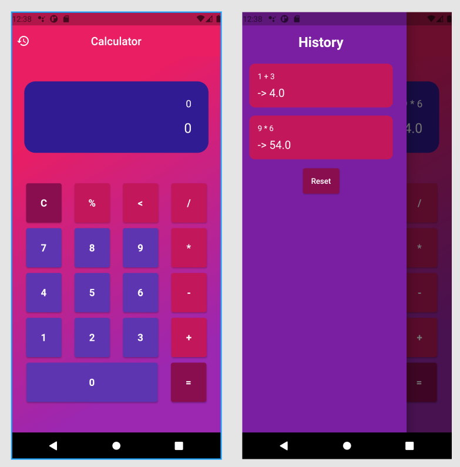

# Flutter Apps (3)
## Basic Calculator

APK Download : [CoolCalculator.apk](https://drive.google.com/u/0/uc?id=1UTJdzs4dFj1QlFFvuyggj4sHqSnyIspv&export=download)

Features :
- Basic App Calculator (Addition, Substraction, Division, Multiplication, and Modulo)
- History Pages

Preview :

